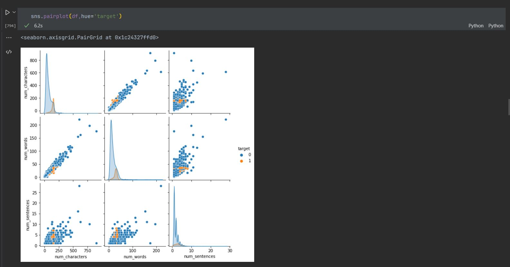
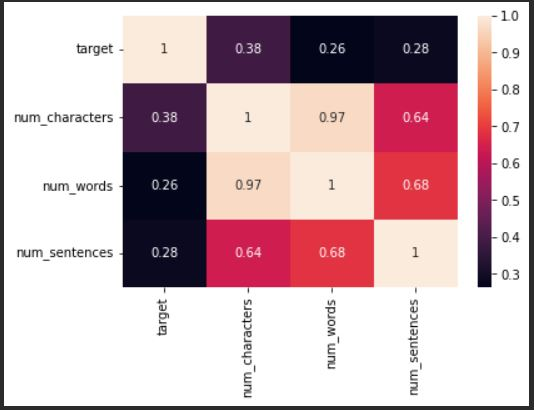
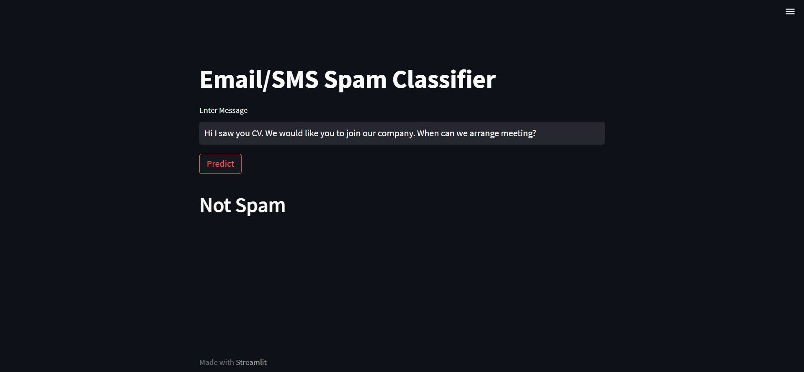

# Spam Email/SMS Detection using Classification

Machine learning project used to detect whether an email or sms is spam or not. Model Code is given in `Model.ipynb`

and to run this project simply run the command:

    `streamlit run app.py`

Model Used: **Multinomial Naive Bayes**

### Analysis on Data:

### Correlation HeatMap

### Website

### References

https://www.youtube.com/watch?v=YncZ0WwxyzU&list=PLKnIA16_RmvY5eP91BGPa0vXUYmIdtfPQ&index=2
